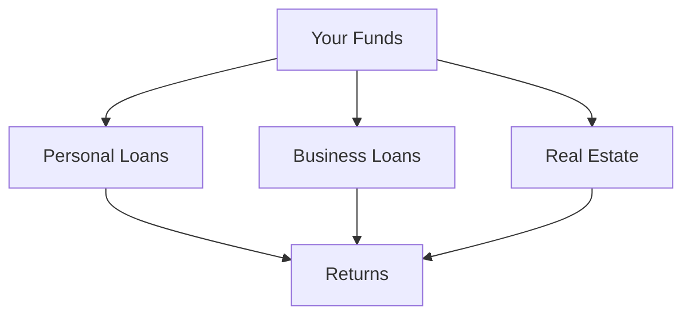

## Overview

Lendermarket provides investors with powerful tools to earn passive income through P2P lending. You can automate investments, monitor performance in real-time, diversify across loan types, and access everything via mobile. These features simplify portfolio management while maximizing returns on a regulated platform.

<Callout kind="tip">
Start with auto-invest to set up hands-off lending, then use the dashboard to track your progress.
</Callout>

## Key Features

<Columns cols={2}>
  <Card title="Auto-Invest" icon="zap" href="#auto-invest">
    Automate your lending strategy with customizable criteria.
  </Card>
  <Card title="Portfolio Dashboard" icon="bar-chart-3" href="#dashboard">
    View real-time performance and analytics.
  </Card>
  <Card title="Diversification" icon="shuffle" href="#diversification">
    Spread risk across multiple loan types.
  </Card>
  <Card title="Mobile App" icon="smartphone" href="#mobile">
    Manage investments on the go.
  </Card>
</Columns>

## Auto-Invest Functionality

Set up auto-invest to lend funds automatically based on your rules, such as loan type, duration, and minimum return. This hands-off approach ensures you never miss opportunities.

<Steps>
  <Step title="Access Settings" icon="settings">
    Log in to your dashboard and navigate to the Auto-Invest section.
  </Step>
  <Step title="Define Criteria">
    Specify parameters like `min_return: ">12%"` and `loan_duration: "12-36 months"`.
  </Step>
  <Step title="Enable via API (Optional)">
````javascript
fetch('https://api.example.com/v1/auto-invest', {
  method: 'POST',
  headers: { 'Authorization': 'Bearer YOUR_TOKEN' },
  body: JSON.stringify({
    enabled: true,
    criteria: { min_return: '>12%', max_amount: 1000 }
  })
});
````
  </Step>
  <Step title="Activate">
    Confirm and start earning passively.
  </Step>
</Steps>

<Expandable title="Advanced Criteria" default-open="false">
Use filters for `loan_originator`, `country`, and risk score to fine-tune.
</Expandable>

## Portfolio Dashboard

The dashboard offers a comprehensive view of your investments. Track returns, cash flow, and portfolio health at a glance.

<Tabs>
  <Tab title="Overview" icon="activity">
    See total invested, earned returns (`>15%` average), and active loans.
  </Tab>
  <Tab title="Performance" icon="trending-up">
    Analyze historical data with charts.
  </Tab>
  <Tab title="Loans" icon="list">
    Drill down into individual loans and payments.
  </Tab>
</Tabs>

## Diversification Options

Diversify to reduce risk by investing across loan types like personal, business, and real estate.



| Loan Type     | Typical Return | Duration     | Risk Level |
|---------------|----------------|--------------|------------|
| Personal     | `12-15%`      | 12-24 months | Medium    |
| Business     | `14-18%`      | 24-60 months | High      |
| Real Estate  | `10-14%`      | 36+ months   | Low       |

<Callout kind="info">
Allocate no more than `20%` per loan type for balanced diversification.
</Callout>

## Mobile App Access

Access your portfolio anytime with the Lendermarket mobile app.

<Tabs>
  <Tab title="iOS" icon="apple">
    Download from the App Store and log in with your credentials.
  </Tab>
  <Tab title="Android" icon="android">
    Install from Google Play. Enable notifications for payment alerts.
  </Tab>
</Tabs>

<CodeGroup tabs="React Native Snippet">
````javascript
// Monitor portfolio via API
const fetchPortfolio = async () => {
  const response = await fetch('https://api.example.com/v1/portfolio', {
    headers: { 'Authorization': `Bearer ${YOUR_TOKEN}` }
  });
  return response.json();
};
````
</CodeGroup>

## Next Steps

<Columns cols={3}>
  <Card title="Quickstart" icon="play" href="/quickstart">
    Set up your first investment.
  </Card>
  <Card title="Authentication" icon="shield" href="/authentication">
    Secure your account.
  </Card>
  <Card title="API Reference" icon="code" href="/api">
    Integrate programmatically.
  </Card>
</Columns>

<Callout kind="success">
These features work together to help you achieve predictable returns. Customize based on your risk tolerance.
</Callout>