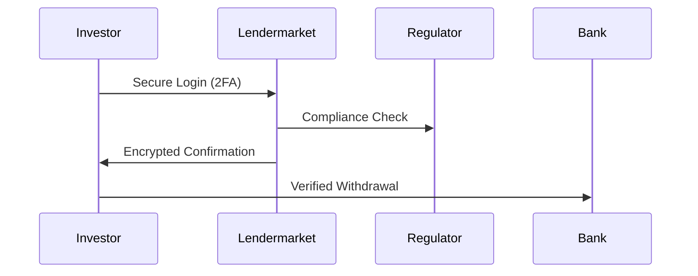

## Overview

Lendermarket prioritizes your account security and regulatory compliance to protect your investments on our P2P lending platform. We implement industry-leading measures including two-factor authentication (`2FA`), end-to-end encryption, adherence to EU crowdfunding regulations, and secure fund handling processes. These features safeguard your data and transactions while maintaining transparency.

<Callout kind="info">
  Enable `2FA` immediately after account creation to add an extra layer of protection against unauthorized access.
</Callout>

<Columns cols={2}>
  <Card title="Regulated Platform" icon="shield" href="#compliance">
    Fully compliant with EU crowdfunding service provider standards.
  </Card>
  <Card title="Zero Commission Fees" icon="dollar-sign" href="#withdrawals">
    Secure, fee-free withdrawals processed efficiently.
  </Card>
</Columns>

## Two-Factor Authentication Setup

Two-factor authentication (`2FA`) requires a second verification step beyond your password, typically using an authenticator app or SMS codes. This prevents account compromise even if your password is exposed.

<Steps>
  <Step title="Enable 2FA" icon="lock">
    Log in to your Lendermarket dashboard at `https://app.lendermarket.com`.

    Navigate to **Account Settings** > **Security**.

    Click **Enable 2FA**.
  </Step>
  <Step title="Scan QR Code" icon="smartphone">
    Download an authenticator app like Google Authenticator or Authy.

    Scan the QR code displayed in your dashboard.

    Enter the 6-digit code from the app to verify.
  </Step>
  <Step title="Save Backup Codes" icon="save">
    Download and store the provided backup codes securely.

    Use these only if you lose access to your authenticator.
  </Step>
</Steps>

<Callout kind="tip">
  Test `2FA` during setup by logging out and back in to confirm it works.
</Callout>

## Data Encryption and Privacy Policies

Lendermarket uses advanced encryption to protect your data both in transit and at rest.

<Tabs>
  <Tab title="In-Transit Encryption" icon="lock">
    All communications use HTTPS with TLS `1.3` and AES-256 encryption.

    API requests require secure headers:

    ```bash
    curl -H "Authorization: Bearer YOUR_TOKEN" \
         -H "Content-Type: application/json" \
         https://api.lendermarket.com/v1/account
    ```
  </Tab>
  <Tab title="At-Rest Encryption" icon="database">
    Sensitive data like investment details is encrypted using AES-256-GCM.

    Your private keys never leave your device.
  </Tab>
  <Tab title="Privacy Policy" icon="file-text">
    We adhere to GDPR standards. Review our full policy at `https://lendermarket.com/privacy`.

    <Expandable title="Key Privacy Commitments">
      - No sharing of personal data without consent
      - Right to data deletion upon request
      - Annual security audits by third-party firms
    </Expandable>
  </Tab>
</Tabs>

## EU Crowdfunding Compliance

As an Authorised EU Crowdfunding Service Provider, Lendermarket complies with all relevant regulations including the European Crowdfunding Service Providers Regulation (`ECSPR`).

<Callout kind="success" title="Regulatory Assurance">
  Your investments are protected by strict EU oversight. We maintain a Trustpilot score of `4.0/5` from `707` reviews.
</Callout>

Key compliance measures include:
- Segregated client funds
- Regular financial reporting
- Investor protection up to `€20,000` via compensation schemes



## Secure Withdrawals and Fund Transfers

Withdrawals are processed securely with multi-step verification to prevent fraud.

<Steps>
  <Step title="Request Withdrawal" icon="arrow-down-circle">
    Go to **Portfolio** > **Withdraw Funds** in your dashboard.

    Enter the amount (minimum `€50`).

    Select your verified bank account.
  </Step>
  <Step title="Verify Identity" icon="check-circle">
    Confirm via `2FA` code.

    Review the transaction details.
  </Step>
  <Step title="Processing" icon="clock">
    Funds are held for `24-48 hours` for security review.

    Receive confirmation email and bank transfer.
  </Step>
</Steps>

<ParamField header="Authorization" param-type="string" required="true">
  Bearer token for all withdrawal API calls.
</ParamField>

<ParamField query="amount" param-type="number" required="true">
  Withdrawal amount in EUR (e.g., `1000.00`).
</ParamField>

All transfers use SEPA for EU users, ensuring fast and secure processing with no commissions.